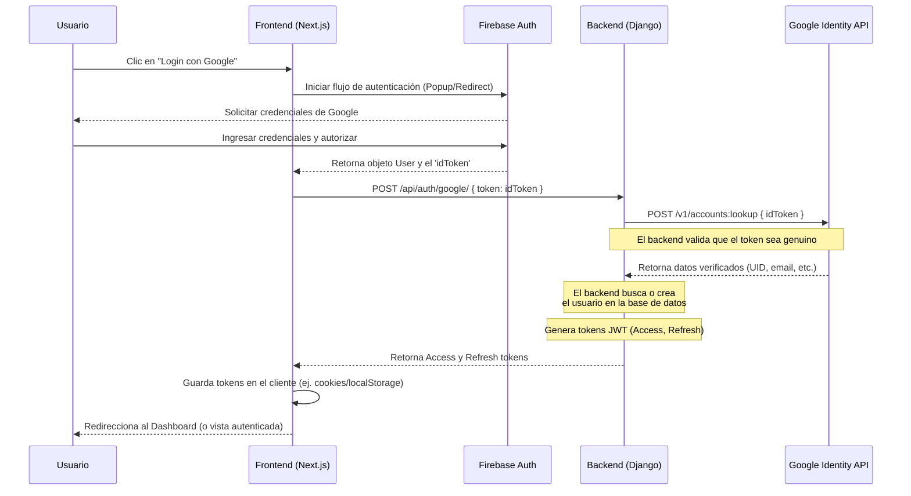

# Diagrama de Secuencia: Autenticación con Google (Firebase)

Este diagrama ilustra el flujo de autenticación implementado en la aplicación, utilizando Firebase en el frontend y validación segura mediante la API de Google Identity en el backend (Enfoque Seguro sin Firebase Admin SDK).

